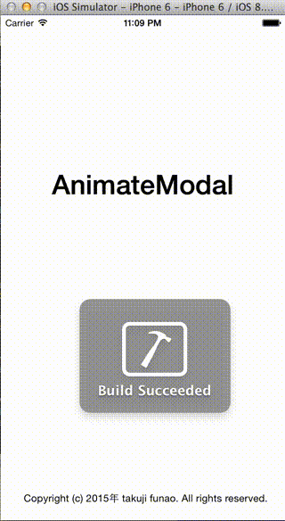

# AnimateModal

[](https://travis-ci.org/takujifunao/AnimateModal)
[](http://cocoapods.org/pods/AnimateModal)
[](http://cocoapods.org/pods/AnimateModal)
[](http://cocoapods.org/pods/AnimateModal)

## Usage

To run the example project, clone the repo, and run `pod install` from the Example directory first.

## Requirements

## Installation

AnimateModal is available through [CocoaPods](http://cocoapods.org). To install
it, simply add the following line to your Podfile:

```ruby
pod "AnimateModal"
```

## Setting

①import AnimateModal.h

```objective-c

#import "AnimateModal.h"

```

②AnimateModal init & call CreateModal

```objective-c

- (void)tapBtn{
    AnimateModal* aniMo = [[AnimateModal alloc] init];
    [aniMo CreateModal:self.view title:@"demo"];
    
    UIButton* btn = [aniMo mainBtn];
    [btn addTarget:self action:@selector(tapModalBtn) forControlEvents:UIControlEventTouchUpInside];
}

- (void)tapModalBtn{
    NSLog(@"aaaaaaaaaaaaaaa");
}

```

③ちなみに、現在はARC下では動かないので、こちらを見て対応してください。（改善中）

http://lab.dolice.net/blog/2013/05/10/objc-arc-switch/

## Author

takujifunao, takuji.funao@gmail.com

## License

AnimateModal is available under the MIT license. See the LICENSE file for more info.

## demo


